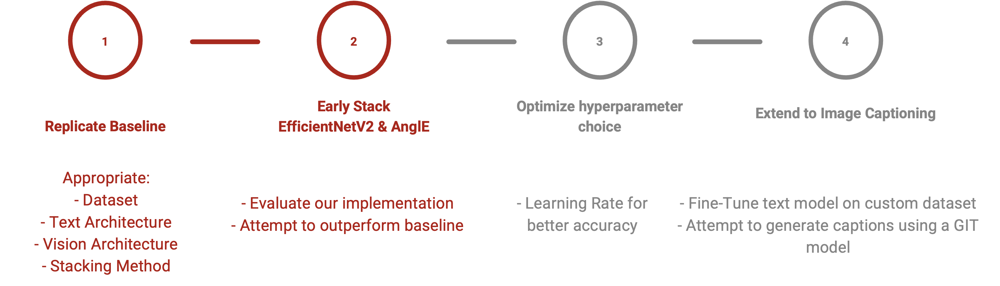
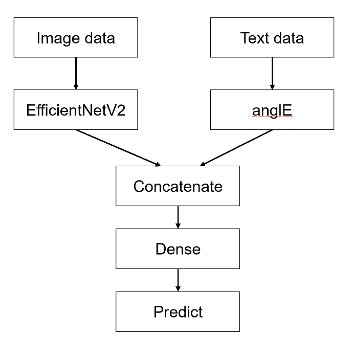
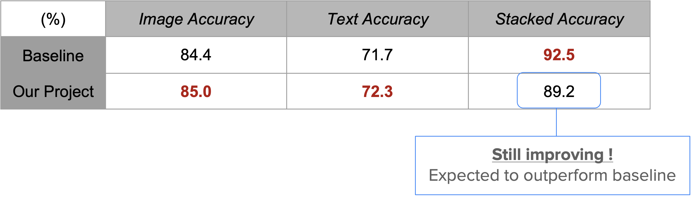

<h1 align="center">AnglEfficientNet: Image-and-Text Fusion for Improved Image Classification</h1>

    

## Overview

This repository contains the source code for the "Image-and-Text Fusion for Improved Image Classification on UPMC Food-101" project. 
The project focuses on enhancing image classification through the fusion of image and text modalities.

Please refer to the **slides** for more detail on:
- Motivation background;
- Architecture design choice;
- Theoretical analysis of AnglE and EfficientNet;
- Discussion and conclusion.

## Project Structure

<em>Figure 1.</em> Project pipeline.

### Image Model
- [Project/image_model.ipynb](Project/image_model.ipynb): Contains the source code for the image model.

### Text Model
- [Project/text_model.ipynb](Project/text_model.ipynb): Contains the source code for the text model.

### Fusion Model  
- [Project/text+image.ipynb](Project/text+image.ipynb): Contains the source code for the Fusion Model

<em>Figure 2.</em> Model architecture.

### Extension - Image Captioning

#### Custom GIT Model for Captioning
- [Extension-ImageCaptioning/GIT_finetuning.ipynb](Extension-ImageCaptioning/GIT_finetuning.ipynb): Contains the code for processing a custom dataset and finetuning a pretrained GIT model to improve textual descriptions for the Food101 dataset.

#### Annotations
- [Extension-ImageCaptioning/annotations.json](Extension-ImageCaptioning/annotations.json): Contains handmade annotations for the 50 images of the custom dataset.

#### Custom Dataset Images
- [Extension-ImageCaptioning/images_custom_dataset.zip](Extension-ImageCaptioning/images_custom_dataset.zip): Contains the 50 images selected to create the custom dataset for finetuning the GIT model.

#### Annotation Creation
- [Extension-ImageCaptioning/create_annotations.ipynb](Extension-ImageCaptioning/create_annotations.ipynb): Used to create annotations for the custom dataset.

## Usage

- Follow the instructions in each notebook to run and understand the code.

## Future Work

<em>Figure 3.</em> Preliminary results.

The "Extension-ImageCaptioning" folder contains code for future work on image captioning using a custom GIT model. This work aims to enhance the textual descriptions of images in the Food101 dataset and improve overall performance with the multimodal model.

Feel free to explore and contribute to the project!
